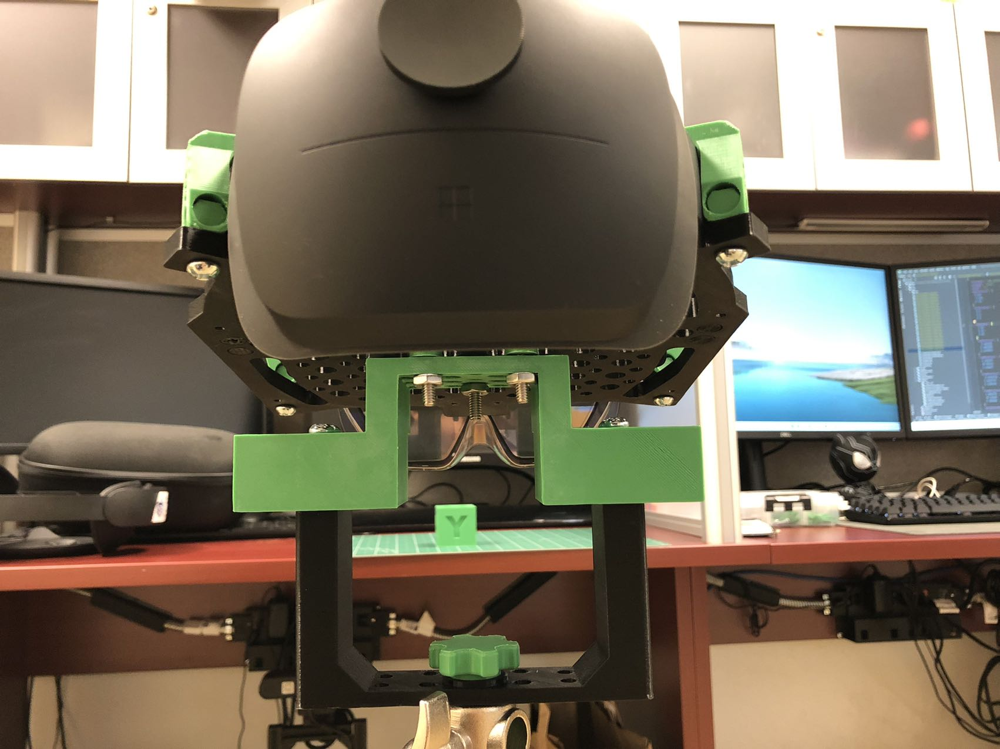

# HoloLens 2 Mount

## Motivation

- Sometimes I need HoloLens 2 to keep still. It's hard to keep it still when I wear it.
- Based on [Hololens Spectator View Mount](https://www.thingiverse.com/thing:2871324)
- Update some files to adapt HoloLens 2
    - Front
    - Plate
    - Camera-Nut
    - Connector (Add)
    - Washer (Add)
- Included 3ds Max file
- **Welcome PR**

## How it looks like

- 
- 
- 
- 
- 
- 
- 
- 

## Preview

> n in "xn" means the needed number to print out.

- Back (x2)
  

- C-Clip
  

- Camera-Nut
  

- Connector
  

- Front (x2)
  

- Mount
  

- Plate
  

- Roll-Pin (x4)
  

- Washer
  

## Screws

> I removed screws because 3D printed screws were not strong enough.

I bought some Machine screws from Home Depot.

- [#12-24 x 3/4 in. Zinc Plated Combo Round Head Machine Screw (5-Pack)](https://www.homedepot.com/p/12-24-x-3-4-in-Zinc-Plated-Combo-Round-Head-Machine-Screw-5-Pack-831341/317479110)

> Connect roll-pin and mount (x4)

- [#12-24 x 1 in. Phillips-Slotted Round-Head Machine Screws (4-Pack)](https://www.homedepot.com/p/Everbilt-12-24-x-1-in-Phillips-Slotted-Round-Head-Machine-Screws-4-Pack-831311/317478835)

> Connect connector and plate (x4)

- [#12-24 x 1-1/2 in. Zinc Plated Combo Round Head Machine Screw (4-Pack)](https://www.homedepot.com/p/12-24-x-1-1-2-in-Zinc-Plated-Combo-Round-Head-Machine-Screw-4-Pack-826141/317479111)

> Connect connector and mount (x3).
> It may need some washers.
> This I bought was flat head, but it doesn't matter.

## Download

[files](files/)

## Print Settings

- Connector, Mount, and Plate
    - Resolution: 0.2mm
    - Infill: 40%

- All others
    - Resolution: 0.1mm
    - Infill: 100%
